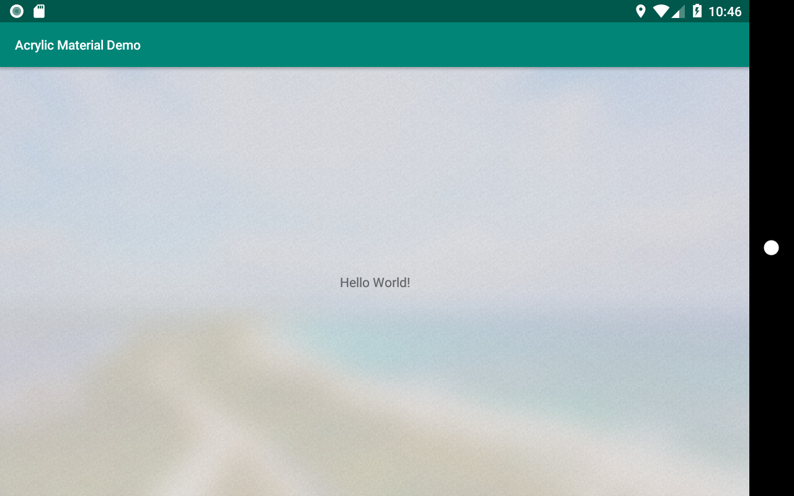

# Acrylic material for Android
Acrylic is a Fluent Design System component that adds physical texture
(material) and depth to your app. To learn more refer:
1. https://medium.com/microsoft-design/science-in-the-system-fluent-design-and-material-42b4dc532c14
2. https://docs.microsoft.com/en-us/windows/uwp/design/style/acrylic

# How to use
First, generate an acrylic drawable using an existing background image
drawable:
```java
Drawable d = AcrylicMaterial
                .with(context)
                .background(R.drawable.background_image)
                .useDefaults()
                .generate();
```

Then use the drawable as a background where the effect is needed!

**NOTE**: You should probably do this on a background thread.

# More options
The above example uses the default configuration by calling `useDefaults()`. The
following example shows all the customization options:

```java
Drawable d = AcrylicMaterial
                 .with(context)
                 .background(R.drawable.background_image)
                 .scaleBy(0.8f) // scale down the background image by 20%
                 .saturation(2f) // saturate 200%
                 .stackBlur(80) // stack blur with radius 80. Also available: gaussianBlur(25f)
                 .tintColor(Color.parseColor("#55FFFFFF"))
                 .noise(R.drawable.noise_layer) // custom noise texture
                 .generate();
```

**NOTE**: For Gaussian blur, the permitted range of radius is (0, 25]. For Stack
blur, the radius must be strictly greater than 0.

# Screenshots
**Original image**


**Acrylic**

